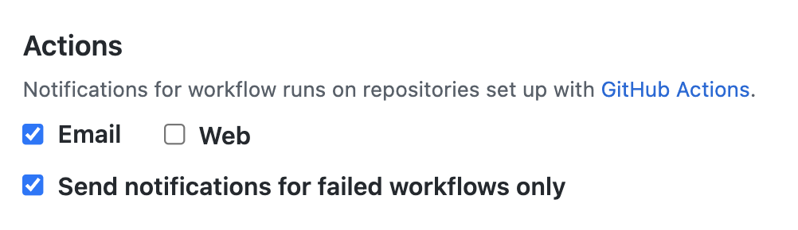

# baekjoon-streak-checker

🏃‍♀️ 백준과 solved.ac 스트릭을 깨트리지 않게 체크해주는 Github Action

## Information

1. solved.ac 스트릭은 KST 06:00를 기준으로 갱신됩니다. 따라서 다음 날 KST 06:00까지 문제를 해결하면 스트릭이 깨지지 않습니다.

1. 본 프로젝트는 매일 KST 23:50분에 당일 문제 해결 여부를 검사하여, 남은 6시간 내에 스트릭이 깨지지 않게 사용자에게 알림을 보내는 것을 목표로 합니다.

## How to use

1. 이 저장소를 fork합니다.

1. `config.yml` 파일에 `user_id` 를 추적할 백준 아이디로 설정합니다.

    ```yaml
    user_id: howlism
    ```

1. [알림 설정](https://github.com/settings/notifications#notifications-github-actions-settings) 페이지에서 Github Action 알람을 활성화합니다.

   

1. Github Action 크론잡에 따라 매일 오후 11시 50분에 실행됩니다. 문제를 풀지 않은 경우 메일이 발송됩니다.

## License

MIT
